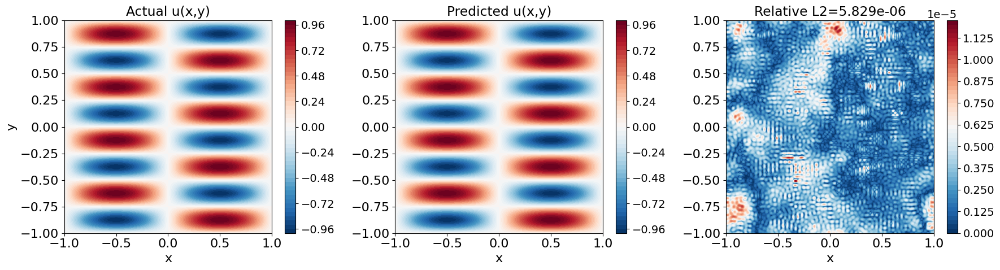

# Residual-based attention in physics-informed neural networks

Please check our original implementation here: https://github.com/soanagno/rba-pinns

Driven by the need for more efficient and seamless physical models and data integration, physics-informed neural networks (PINNs) have seen a surge of interest in recent years. However, ensuring the reliability of their convergence and accuracy remains a challenge. In this work, we propose an efficient, gradient-less weighting scheme for PINNs that accelerates the convergence of dynamic or static systems. This simple yet effective attention mechanism is a bounded function of the evolving cumulative residuals. It aims to make the optimizer aware of problematic regions at no extra computational cost or adversarial learning. We illustrate that this general method consistently achieves one order of magnitude faster convergence than vanilla PINNs and a minimum relative L2 error of O(10-5), on typical benchmarks of the literature. The method is further tested on the inverse solution of the Navier–Stokes within the brain perivascular spaces, where it considerably improves the prediction accuracy.
Furthermore, an ablation study is performed for each case to identify the contribution of the components that enhance the vanilla PINN formulation. Evident from the convergence trajectories is the ability of the optimizer to effectively escape from poor local minima or saddle points while focusing on the challenging domain regions, which consistently have a high residual score. We believe that alongside exact boundary conditions and other model reparameterizations, this type of attention mask could be an essential element for fast training of both PINNs and neural operators.

# Citation
@article{anagnostopoulos2024residual,
  title={Residual-based attention in physics-informed neural networks},
  author={Anagnostopoulos, Sokratis J and Toscano, Juan Diego and Stergiopulos, Nikolaos and Karniadakis, George Em},
  journal={Computer Methods in Applied Mechanics and Engineering},
  volume={421},
  pages={116805},
  year={2024},
  publisher={Elsevier}
}

Paper: https://doi.org/10.1016/j.cma.2024.116805

